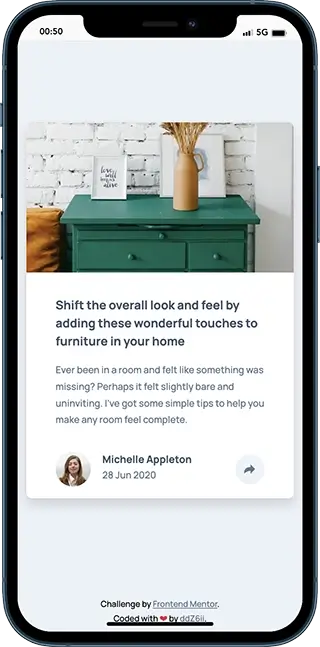
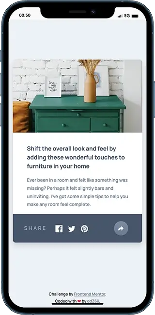
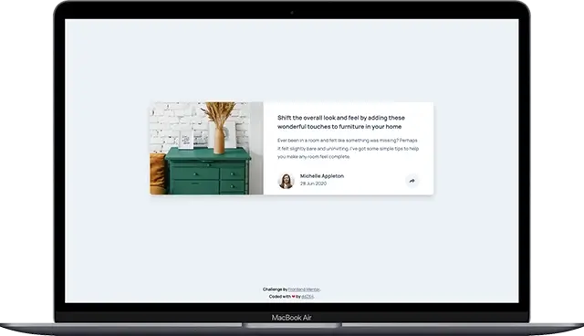
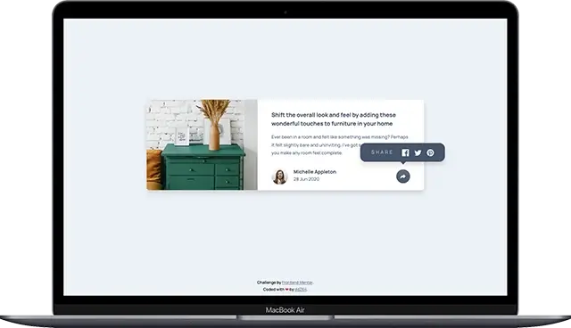

# Frontend Mentor - Article preview component solution

This is a solution to the [Article preview component challenge on Frontend Mentor](https://www.frontendmentor.io/challenges/article-preview-component-dYBN_pYFT). Frontend Mentor challenges help you improve your coding skills by building realistic projects.

## Table of contents

- [Overview](#overview)
  - [The challenge](#the-challenge)
  - [Screenshots](#screenshots)
  - [Links](#links)
- [Getting started](#getting-started)
- [My process](#my-process)
  - [Built with](#built-with)
  - [Deployed with](#deployed-with)
- [Useful resources](#useful-resources)
- [Author](#author)

## Overview

### The challenge

Users should be able to:

- View the optimal layout for the component depending on their device's screen size
- See the social media share links when they click the share icon

### Screenshots

- Mobile:

  
  

- Laptop/Desktop:

  
  

### Links

- Solution URL: [frontend-mentor-solution](https://www.frontendmentor.io/solutions/responsive-article-preview-component-with-bootstrap5-and-dart-sass-UTJZ-vHtaO)
- Live Site URL: [article-preview-component](https://article-preview-component-fawn.vercel.app/)

## Getting started

1. Clone the project and run the following command:

```console
yarn install
```

This will initialize the project by installing all the required dependencies.

2. Start the development server:

```console
yarn run dev
```

3. Build for production (output to the `/dist` folder):

```console
yarn run build
```

## My process

### Built with


- Semantic HTML5 markup
- CSS grid, flexbox, nesting
- Bootstrap 5
- Dart Sass
- Vite bundler
- Mobile-first workflow

### Deployed with


## Useful resources

- [Bootstrap Popovers](https://getbootstrap.com/docs/5.3/components/popovers/) - Official documentation for using and customizing popovers
- [Medium](https://mgregchi02.medium.com/how-to-add-html-contents-and-style-to-bootstrap-5-popover-db2d910f8844) - How to add HTML contents and style to Bootstrap 5 popover
- [Popover Widget](https://demo.yootheme.com/joomla/widgetkit/uikit/home/popover/) - Implementation example of nice popovers

## Author

- Github - [ddZ6ii](https://github.com/ddZ6ii)
- Frontend Mentor - [ddZ6ii](https://www.frontendmentor.io/profile/ddZ6ii)
- Linkedin - [denis-dezest](https://www.linkedin.com/in/denis-dezest/)
